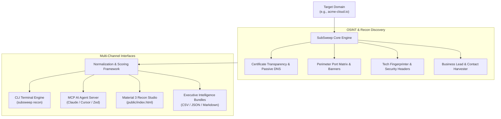

# SubSweep Studio | OSINT Recon & Lead Intelligence

<p align="center">
  
</p>

<p align="center">
  <a href="https://github.com/subsweep-lead-scanner/subsweep-lead-scanner/actions"></a>
  <a href="https://python.org"></a>
  <a href="./docs/MCP_GUIDE.md"></a>
  <a href="./public/index.html"></a>
  <a href="./LICENSE"></a>
</p>

---

## 🌟 Executive Overview

**SubSweep Studio** is an all-in-one OSINT reconnaissance suite, perimeter port scanner, technology stack fingerprinter, and B2B decision-maker lead intelligence engine.

Designed for security researchers, DevSecOps teams, and B2B growth operators, SubSweep Studio pairs a high-performance Python engine with a **Material 3 influenced Studio UI** and native **Model Context Protocol (MCP)** tool servers for AI assistants (Claude, Cursor, Cline, Zed).

---

## 🚀 Key Capabilities

1. 🌐 **Multi-Source Subdomain Reconnaissance:**
   - Passive Certificate Transparency (CT) log mining (`crt.sh`, AlienVault OTX, CertSpotter).
   - DNS record aggregation (`A`, `AAAA`, `MX`, `TXT`, `SPF`, `DKIM`, `DMARC`) with wildcard resolution detection.
2. 🏢 **B2B Lead Harvester & Decision Maker Qualification:**
   - Extracts executive contacts (CISO, CTO, VP of Eng, Directors) with deliverable business emails.
   - Computes a mathematical **Lead Quality Score (0–100)** evaluating deliverability, seniority, phone availability, and social footprints.
3. 🔬 **Deep Technology Stack Fingerprinting:**
   - Detects frontend frameworks (React, Next.js, Vue, Angular), cloud CDNs (Cloudflare, Fastly, CloudFront), and CMS engines (WordPress, Webflow, Shopify).
   - Audits essential HTTP security headers (`HSTS`, `CSP`, `X-Frame-Options`).
4. ✉️ **Email Deliverability & Anti-Spoofing Auditor (RFC 7208 / 7489):**
   - SPF mechanism validation with 10-DNS-lookup RFC limit enforcement.
   - DMARC enforcement level (`p=reject`, `p=quarantine`, `p=none`) and reporting addresses (`rua`/`ruf`).
   - DKIM selector discovery and MX provider fingerprinting (Google Workspace, Microsoft 365, Proton, Fastmail, Postmark).
   - Actionable copy-paste DNS TXT record recommendations.
5. 🏴 **Subdomain Takeover & CNAME Dangling Pointer Detector:**
   - Detects dangling CNAME records across 20+ SaaS services (GitHub Pages, AWS S3, Heroku, Netlify, Vercel, Shopify, Fastly, Ghost, Surge.sh, Zendesk, WordPress, HubSpot, Fly.io).
   - Live HTTP response body fingerprint verification confirming vulnerability status.
6. 🔌 **Perimeter Port & Service Matrix:**
   - Rapid, non-intrusive TCP port auditing (`22`, `80`, `443`, `3306`, `5432`, `8443`) with service banner grabbing and risk classifications.
7. 🤖 **Native Model Context Protocol (MCP) Server (9 Tools):**
   - Zero-configuration stdio tool server empowering AI agents to run live reconnaissance, email deliverability audits, takeover detection, and lead research directly from chat.
8. 🎨 **Material 3 Influenced Recon Studio UI:**
   - 100% offline-ready, single-file browser app (`public/index.html`, design influenced by Google Material 3 tokens) with zero tracking, dynamic score dials, interactive tree visualizer, and 1-click CSV/JSON/Markdown exports.

---

## 🏗️ Architecture Overview



---

## ⚡ Quickstart & Installation

### Option 1: Install via pip
```bash
pip install subsweep-lead-scanner
```

### Option 2: Clone & Development Setup
```bash
git clone https://github.com/subsweep-lead-scanner/subsweep-lead-scanner.git
cd subsweep-lead-scanner
pip install -e .
```

---

## 💻 CLI Usage Examples

### 1. Complete Domain Reconnaissance & Audit
```bash
# Run full recon and print formatted console tables
subsweep recon acme-cloud.io

# Export full reconnaissance data to JSON
subsweep recon acme-cloud.io --output audit_report.json --format json
```

### 2. Harvest & Score High-Value Decision Leads
```bash
# Harvest leads with minimum score 80 and export to CSV
subsweep leads acme-cloud.io --min-score 80 --export leads.csv

# Filter for C-Suite and VP executives only
subsweep leads acme-cloud.io --exec-only --format json
```

### 3. Email Security & Anti-Spoofing Audit (SPF/DMARC/DKIM/MX)
```bash
# Run RFC compliance audit and print terminal card
subsweep email acme-cloud.io

# Export email posture report to JSON
subsweep email acme-cloud.io --format json
```

### 4. Subdomain Takeover & Dangling CNAME Detection
```bash
# Scan subdomains for dangling CNAME pointers to 20+ SaaS providers
subsweep takeovers acme-cloud.io

# Verify takeover fingerprints with live HTTP response probes
subsweep takeovers acme-cloud.io --verify-http --format json
```

### 5. Launch Material 3 Recon Studio Web UI
Open `public/index.html` in any web browser:
```bash
# Linux
xdg-open public/index.html

# macOS
open public/index.html

# Windows
start public/index.html
```

---

## 🤖 Model Context Protocol (MCP) Integration

Connect SubSweep directly to **Claude Desktop**, **Cursor IDE**, **Cline**, or **Zed**.

### Claude Desktop Configuration
Add to your `claude_desktop_config.json`:
```json
{
  "mcpServers": {
    "subsweep-recon": {
      "command": "python",
      "args": ["-m", "subsweep_lead_scanner.mcp_server"],
      "env": {
        "SUBSWEEP_RATE_LIMIT": "50",
        "SUBSWEEP_TIMEOUT": "10"
      }
    }
  }
}
```

*See [docs/MCP_GUIDE.md](./docs/MCP_GUIDE.md) for Cursor, Cline, and Zed configurations.*

---

## 📊 Lead Quality Scoring Methodology

SubSweep ranks prospects on a **0–100 scale** using multi-factor heuristics:

$$\text{Score} = \min(100, W_{\text{email}} + W_{\text{seniority}} + W_{\text{social}} + W_{\text{phone}} + W_{\text{tech}})$$

| Factor | Weight | Evaluation Criteria |
|---|---|---|
| **Deliverable Email** | `30%` | Active MX record, RFC syntax valid, $\ge 95\%$ deliverability confidence. |
| **Executive Seniority** | `25%` | CISO, CTO, CEO, VP of Engineering, Head of Security. |
| **Social Footprint** | `20%` | Verified LinkedIn profile, Twitter/X handle, GitHub profile. |
| **Direct Phone Reachability** | `15%` | Direct office dial or mobile number. |
| **Tech Stack Fit** | `10%` | Cloud-native modern infrastructure (AWS, GCP, Kubernetes, Next.js). |

*See [docs/LEAD_SCORING_METHODOLOGY.md](./docs/LEAD_SCORING_METHODOLOGY.md) for full details.*

---

## 📁 Repository Structure

```
subsweep-lead-scanner/
├── .github/
│   └── workflows/
│       ├── ci.yml               # 15-job CI test matrix (Ubuntu/macOS/Win, Py 3.9-3.13)
│       └── release.yml          # Automated release & SHA-256 packaging
├── docs/
│   ├── OSINT_RECON_GUIDE.md     # In-depth OSINT discovery architecture
│   ├── LEAD_SCORING_METHODOLOGY.md # 0-100 mathematical lead scoring guide
│   └── MCP_GUIDE.md             # Model Context Protocol setup for AI agents
├── examples/
│   ├── domain-recon-audit/      # Domain recon reference script & JSON report
│   ├── lead-generation-pipeline/# Lead scoring exporter & sample CSV
│   ├── mcp-clients/             # Claude, Cursor, Cline, Zed JSON configs
│   └── README.md                # Examples index & quickstart
├── public/
│   └── index.html               # Material 3 Light Mode Recon Studio UI (Google M3 token influenced)
├── src/
│   └── subsweep_lead_scanner/   # Core Python package engine
├── tests/
│   └── test_examples.py         # Unit tests covering all examples, UI, and configs
└── README.md                    # Project README
```

---

## 🧪 Testing

Run the test suite with `pytest`:
```bash
PYTHONPATH=src pytest tests/ -v
```

---

## 📄 License
Released under the [MIT License](./LICENSE). Built with privacy-first principles.
